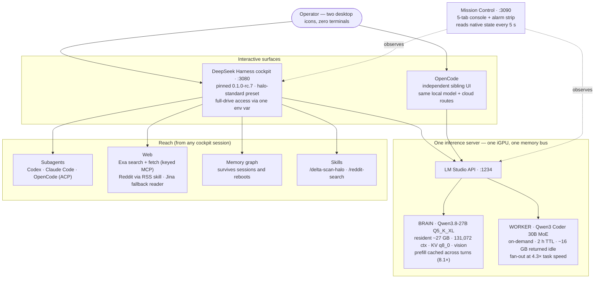
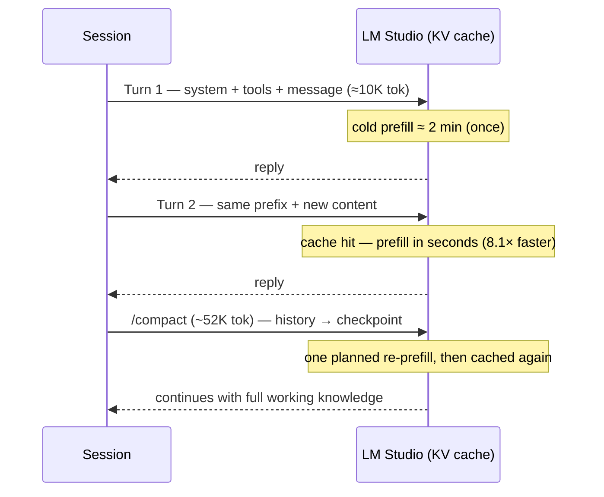
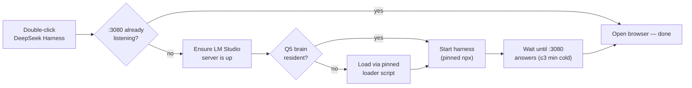

# HALO Stack — User Manual

Daily operation of the local AI stack. For design rationale and bench data, see the
[build log](https://quartz-entry-ptf2.here.now/) (archived in this repo as
`docs/build-log-snapshot-2026-08-17.html`).

## The pieces and their addresses

| Piece | Where | Started by |
|---|---|---|
| Cockpit (DeepSeek Harness) | `http://127.0.0.1:3080` | Desktop icon **DeepSeek Harness** |
| Mission Control dashboard | `http://127.0.0.1:3090` | Desktop icon **Mission Control** |
| LM Studio inference server | `http://127.0.0.1:1234` | Runs as a service at login |
| OpenCode | its own app | On demand (autostart removed on purpose) |

This table is enforced, not just documented: `scripts\Deploy-ToLive.ps1` ends
every run with an **audit stage** that checks each row (plus the memory-snapshot
task, desktop icons, and subagent plugins) against the live machine and prints
PASS/MISSING per row. The install steps themselves live in one place — the
README's **Full machine rebuild** checklist.

## Architecture

Two interactive surfaces share one inference server; the harness owns
orchestration; a thin dashboard watches everything and owns nothing.

**Why it's fast despite slow silicon** — the request shape is the load-bearing
decision. Every harness request is a byte-exact extension of the previous one,
so the expensive prompt-reading step (prefill) is paid once per session, not
every turn:

**How the launcher boots everything in the right order** (the desktop icon):

Diagrams render on GitHub's repo view. The full architecture rationale —
source-level findings, config composition, permission model, bench data —
lives in the [build log](https://quartz-entry-ptf2.here.now/) (archived here
as `build-log-snapshot-2026-08-17.html`).

## Technology stack — what runs, why, and the proofs

This section is for developers who want the design specifics, not just the
operating instructions above. Every number below is measured on this machine
or read from a live config file — proofs are cited inline and collected in
the index table at the end. Where the record has a caveat (a split that can
drift, a bug still open, a claim that got refuted by a later audit), that
caveat is kept, not smoothed over.

### 1. Silicon — AMD Strix Halo

**What:** an AMD Strix Halo APU with 128 GiB of physical unified memory
shared between CPU and iGPU (no discrete VRAM). `mission-control.mjs` hardcodes
`MACHINE_TOTAL_RAM = 128 * 1024³` bytes with an explicit comment: *"Machine has
128 GiB unified physical RAM (Strix Halo APU)"*. The 128 GiB is split into a
Windows-visible pool and a GPU carveout — currently 64 GiB / 64 GiB — set in
AMD Adrenalin's VGM control, not by this stack. Memory bandwidth is
~256 GB/s.

**Why:** unified memory is the entire reason a 21 GB-class dense brain, a
16 GB-class MoE worker, and a 131,072-token KV cache (q8_0) can all be resident at
once on one box. A discrete 16–24 GB card cannot hold this working set —
this stack's two-model, long-context design would not fit on one. The
~256 GB/s bandwidth ceiling (vs. a 5090's ~1,792 GB/s) is the real constraint
behind almost every other decision in this document: it's why prefill reuse
(§4e below) matters so much more here than on fast discrete silicon, and why
decode throughput, not compute, is what every model and engine choice below
is measured against.

**Proof:** `mission-control/mission-control.mjs` (`MACHINE_TOTAL_RAM` constant
and its comment) is the live source for the 128 GiB total. The same file
deliberately does **not** hardcode the 64/64 GiB VGM split — its own comment
reads *"do NOT hardcode a fixed 64/64 number, it drifts"* — and instead
computes the split at runtime from `os.totalmem()` vs. the GPU carveout. The
~256 GB/s bandwidth figure and the 5090 comparison are recorded in
`Claude-Harness-HALO-Design-v2.md` §2 and `HALO-Stack-Monitor-Prompt.md`. If
you're reading this on different hardware, re-measure — don't trust the
64/64 number as a constant, the stack's own monitoring code refuses to.

### 2. Inference server — LM Studio + llama.cpp Vulkan engine

**What:** LM Studio, running the llama.cpp Vulkan backend, serving both
models from one process at `127.0.0.1:1234`.

**Why Vulkan, not ROCm:** measured, not assumed. LM Studio's Windows ROCm
runtime for this chip (gfx1151) crashes on non-small models — the exact
crash case is this stack's 21 GB Q5 brain (`lmstudio-ai/lms` issue #494) —
and mis-sizes unified memory (`lms` issue #589). The upstream fix for #589
landed in `llama.cpp` build b10472's HIP UMA change but has not shipped in
an LM Studio engine build yet. Two ripeness gates are tripwired in the
`delta-scan-halo` skill (issue #494 closed, and b10472+ shipped in an
LM Studio engine) — Vulkan stays until both clear.

**Why LM Studio's wrapper, not bare llama.cpp:** benched head-to-head, same
GGUF, same machine, MTP engaged on both. A bare `llama-server` at b10472
matched LM Studio within noise (19.5K-token fresh prefill: 177.8 tok/s /
110.0 s vs. LM Studio's 181 tok/s / 108.6 s; decode 20.2 vs. 19.7 tok/s;
cached follow-up turn 15.6 s vs. 13.4 s — LM Studio's cached-turn handling
was slightly *better*). The management layer — stable model identities,
`lms ps --json`, the on-demand loader/TTL scripts — costs nothing measured
and is kept.

**Truth-source discipline:** `lms ps --json` is the only reliable report of
what's actually loaded. The REST catalog (`/api/v0/models`) lies about
quantization for aliased identifiers — Mission Control's Models tab and
every bench script in this repo read `lms ps --json`, never the REST
catalog.

**Service-broker pattern:** both models are pinned under stable API
identifiers (`qwen/qwen3.8-27b`, `qwen3-coder-30b-a3b-instruct`) by the
loader scripts in `lmstudio/*.mjs`, so a model swap, quant change, or
reload never perturbs a consumer (OpenCode, the harness, a subagent) —
they all keep talking to the same identity. This is the Cordis paper's
*service broker* pattern (§6.2), arrived at independently and then
recognized as the sanctioned pattern in `AUDIT-cordis-concepts-2026-08-18.md`.

**MTP speculative decoding:** stock configuration — `speculativeDraftMaxTokens: 4`,
`speculativeDraftMinContinueProbability: 0.5` — measured optimal. A sweep
tool (`lmstudio/Sweep-MTP.mjs`) exists specifically to challenge this, and a
deeper-drafting sweep lost. Draft acceptance is content-dependent and was
logged at 52.4% on prose vs. 86.5% on structured content.

**Proof:** ROCm crash/mis-sizing citations and the Vulkan-vs-bare-llama.cpp
bench table are in `docs/phases/bench-day-2-results.md`. The gates are
recorded in `dsh/skills/delta-scan-halo/SKILL.md`. The truth-source rule and
service-broker framing are in `docs/USER-MANUAL.md` (Model operations,
below) and `docs/AUDIT-cordis-concepts-2026-08-18.md`. MTP config values are
live in `lmstudio/Load-OpenCode-Qwen.mjs` and `lmstudio/Sweep-MTP.mjs`;
acceptance rates are in `docs/phases/bench-day-2-results.md`.

### 3. Models

**Brain — Qwen3.8-27B UD-Q5_K_XL** (unsloth dynamic quant), dense, loaded at
131,072-token context (adopted 2026-08-19, `docs/phases/bench-window-131k.md` — KV q8_0 makes the doubled window cost what 65,536/f16 did), vision-capable, under the stable identity
`qwen/qwen3.8-27b`. Resident memory measured at 19.7 GB (the architecture
diagram above rounds this to 21 GB). Measured on a 19.6K-token probe
prompt: fresh prefill 181 tok/s (TTFT 108.6 s cold) → 13.4 s cached
(**8.1×** speedup, `contextCheckpoints: 32`). Decode 26.9 tok/s solo, 19.0
tok/s under concurrent load (**−29%** — two models sharing one memory bus
contend, see §2).

Reasoning-effort mapping (live in `dsh/settings.yaml`): the composer's
**High** setting maps to `medium` on this model — Qwen3.8 has no real "high"
tier (only low/medium/xhigh), and `xhigh` burns 17–22K thinking tokens per
turn on this box. At the model's own thinking-token decode rate (~27 tok/s,
per `dsh/skills/delta-scan-halo/SKILL.md`), that's roughly 10–14 minutes of
decode before the model produces a visible answer — a derived estimate from
those two measured figures, not a separately timed one. `xhigh` is
explicit opt-in only; nothing in this stack selects it by default.

**Worker — Qwen3-Coder-30B-A3B MoE Q4_K_S**, resident ~16.3 GB, loaded
on-demand with a 2-hour TTL (`lmstudio/Load-Worker-Coder.mjs`). Measured:
fresh prefill 615 tok/s, decode 90.9 tok/s solo / 87.8 tok/s concurrent
(only −3%, vs. the brain's −29% — the smaller active-parameter footprint
contends less). On a real two-bug harness repair task, the worker finished
in 41 s vs. the brain's 176 s — **4.3× wall-clock** at equal correctness
(4/4, both runs). This is the fan-out workhorse: subagent, workflow, and
Ralph tasks route here, not to the brain.

**Proof:** all figures above are in `docs/phases/phase2-bench-results.md`
(the probe and harness-task tables) and `docs/phases/bench-day-2-results.md`
(MTP acceptance, ROCm/bare-llama.cpp challenges). Reasoning-effort mapping
is live in `dsh/settings.yaml`. Model identifiers and load parameters are
live in `lmstudio/Load-OpenCode-Qwen.mjs` and `lmstudio/Load-Worker-Coder.mjs`.
Verdicts (why the brain stays Standard-mode dense, why the worker is
on-demand not resident) are recorded in `docs/phases/phase2-bench-results.md`
§Verdicts and reconfirmed in `docs/phases/bench-day-2-results.md`.

### 4. The kernel — DeepSeek Harness (pinned `0.1.0-rc.7`) on Cordis

This is the layer worth going deep on if you're extending this stack.

**(a) Everything is a plugin.** The running harness is composed from 166
config rows (visible live in Mission Control's Plugins tab) — MCP servers,
subagents, compaction/pruning, permission, the model route, all of it are
rows in the same config surface, not special-cased code paths.

**(b) The formal model underneath.** The harness's Cordis kernel implements
the model from *"A Programming Paradigm for Spatiotemporal Composability"*
(Shi, Zhang, Cui — Peking University / DeepSeek-AI). Three concepts a
developer working on this stack needs:
- **Revertible effects** — every change a plugin makes carries a tracked
  inverse; teardown is *derived*, not hand-written, so unloading a plugin
  provably leaves no trace.
- **Reactive coeffects** — a plugin declares its dependencies and
  activates/deactivates automatically as they appear or disappear (this is
  why a "waiting" plugin — dependency not yet satisfied — is not an alarm
  condition, just a state).
- **Confluence theorem** — the config file alone determines the running
  system's final state, regardless of the sequence of edits that got there.
  History leaves no trace; a `disabled: true` toggle is the sanctioned
  reversible operation, not row deletion.

**(c) Config reconciliation is LIVE — proven on this machine.** A row
(`web-search-deepseek`) was toggled in `~\.dsh\cordis.patch.yml` while the
harness was serving production sessions. The fiber activated ~20 seconds
after save (plugin inventory 136→137 active), and disabling it again
withdrew the effect cleanly (137→136) — both directions, zero restart, zero
disturbance to running sessions. Every restart this stack used to do for a
config change was unnecessary; the flip side is that a *bad* edit reaches
production in the same ~20 seconds, which is why deploys are transactional
(§7 below).

**(d) Config layering — the footgun developers need to know about.**
Layers apply in this order, later wins: **bundles → profile
`cordis.patch.yml` → home `cordis.patch.yml` → `--patch` overlays**, and
overlays stack (validated: `dsh --patch <overlay> --dump-config` composes
correctly with multiple overlays applied). The footgun: **a patch row
replaces the targeted row's entire config — there is no deep merge.**
Patch a row meaning to change one field, and every other field in that
row's config reverts to whatever the patch provides (or nothing, if
omitted). `--dump-config` (vs. `--dump-default-config`) is the validation
gate that catches this — both `Sync-FromLive.ps1` and `Deploy-ToLive.ps1`
run it and treat unmatched/warning output as a failure. `DSH_HOME` is the
environment variable that overrides the config root entirely; this stack's
transactional deploy uses it to compose and validate a fully staged config
tree in a sandbox directory before anything touches the live home.

**(e) The prefix-cache request invariant.** Every request the harness sends
is a byte-exact extension of the previous request in the session — the
session log is append-only, and compaction/pruning/plan-mode are all
engineered as cache-safe surface replacements. This means prefill (the
expensive prompt-reading step) is paid once per session, not once per turn
— the 8.1× TTFT figure in §3 above is this invariant cashing out in a real
measurement. Compaction is the one planned exception: at the 131,072-context
brain's compaction settings (80% trigger / 16% retain / 8,192-token summary
cap), a compaction event costs one deliberate re-prefill, measured at ~80 s
in production shape (TTFT sequence: 157 s cold → 13 s cached → 80 s
post-compaction).

**(f) Five known rc.7 Windows bugs and their workarounds** are already
listed in the README and are not duplicated here.

**Proof:** the formal-model summary and the live reconciliation experiment
are both in `docs/AUDIT-cordis-concepts-2026-08-18.md`. Config layering and
the replace-not-merge rule are documented in
`docs/Claude-Harness-HALO-Design-v2.md` §4 and enforced live by
`scripts/Sync-FromLive.ps1` / `scripts/Deploy-ToLive.ps1`. The 166-row count
and plugin-tab behavior are in this manual's Mission Control section above.
Compaction settings and the ~80 s re-prefill cost are in
`docs/phases/phase4-harden-results.md`.

### 5. Reach — search, subagents, skills, memory

**Web search:** Exa's keyed MCP server — free tier funds roughly 1,400
searches/month recurring once `EXA_API_KEY` is set in `~\.dsh\.env`
(`dsh/dot-env.template`); the key is referenced by environment variable
everywhere it's used and is never committed. **Reddit is reached only via
the `reddit-search` skill's RSS procedure** — Exa serves zero reddit.com
results (a licensing hole, confirmed by the skill's own measurement notes),
Jina's reader is blocked by Reddit, and the skill's own JSON API 403s this
machine. Reddit's `.rss` feeds are the one path that works, paced at ≥8
seconds between requests to respect the ~10 req/min anonymous rate limit
(`agents-skills/reddit-search/SKILL.md`).

**Subagents:** a trio — `codex`, `claude-code`, `opencode` (via ACP) — each
on existing local auth, registered as host-plane rows in
`dsh/cordis.patch.yml`. Windows-specific note: the OpenCode ACP provider
must be spawned as `cmd /c opencode acp`, because npm's `.ps1`/`.cmd` shims
aren't directly spawnable by the ACP client.

**Skills:** the sanctioned extension surface for adding capability without
writing plugin code. `delta-scan-halo` runs a weekly self-audit of the
stack's own upstream (harness releases, the five known bugs, new quants,
llama.cpp changes, community findings) and tracks scan state in the memory
graph. Skills live in a **shared root** (`~\.agents\skills`) that's visible
to both Claude Code and the harness — `reddit-search` is written once and
usable from either.

**Memory:** an MCP knowledge-graph server (`@modelcontextprotocol/server-memory`)
backed by `~\.dsh\memory\memory.json`, recalling facts across sessions and
reboots. The boundary caveat, in the Cordis paper's own terms: this file is
an *emission* — a write the harness's revertible-effects machinery cannot
undo, sitting outside the Cordis realm boundary entirely (the memory MCP's
real isolation point is an `env.MEMORY_FILE_PATH` handed to a spawned
subprocess, not the `isolate` mechanism the loader actually implements —
confirmed by source read, not assumption). Two compensations follow
directly from that finding: an hourly change-detected snapshot task
(`dsh/memory/Snapshot-Memory.ps1`, SHA256 dedup, last-60 rotation,
registered as scheduled task **HALO Memory Snapshot**), and bench/overlay
sessions pointed at a wholesale-replaced `mcp-memory` row targeting a
scratch graph (`dsh/overlays/bench-overlay-*.yml`) so experiments can never
write the production knowledge graph.

**Proof:** Exa tier and key handling are in `dsh/dot-env.template` and
`dsh/cordis.patch.yml`. Reddit access facts are in
`agents-skills/reddit-search/SKILL.md`. The subagent trio and the ACP
Windows fix are live in `dsh/cordis.patch.yml`. Skills and the shared root
are documented in `dsh/skills/delta-scan-halo/SKILL.md` and the shared-root
comment in `scripts/Sync-FromLive.ps1`. The memory boundary finding,
snapshot compensation, and bench-overlay isolation are all in
`docs/AUDIT-cordis-concepts-2026-08-18.md` §4 and §6.

### 6. Observability — Mission Control

**What:** `mission-control/mission-control.mjs` — a single Node file (1,308
lines as of this release), zero dependencies — serving a five-tab operator
console (Overview / Models / Sessions / Plugins / System) behind a master
alarm strip at `127.0.0.1:3090`.

**Why built custom, and why thin:** an earlier self-grade claimed Mission
Control "duplicates nothing." An adversarial audit refuted that — the
harness already ships session/workspace/job/plugin-inventory RPCs
(`apiproxy`) and a WebSocket event stream (`events.mux`) that Mission
Control was hand-parsing the sessions directory instead of consuming. It
was refactored the same night to consume those native RPCs and the
WebSocket stream when the cockpit is up, falling back to a directory scrape
only when the harness is down (its intended watchdog role). What's
legitimately custom: the LM Studio model card, RAM/GPU pool readings, and
the "start the cockpit when the harness is dead" role — none of which the
harness exposes.

**What it reads and owns:** native surfaces only — `dsh` `apiproxy` RPCs,
the `events.mux` WebSocket, the `lms` CLI, and GPU/RAM perf counters via
`os.totalmem()` and the Adrenalin-visible carveout split. It owns no state
of its own beyond two small trend/cadence files (`mc-state.json`,
`mc-history.jsonl`).

**The plugin card speaks the Cordis lifecycle**, not an ad hoc
enabled/abnormal binary: **active / disabled / waiting / transitioning /
failed**, plus a **stuck** flag when a fiber sits in the same transitional
phase for more than 60 seconds (`STUCK_MS = 60000` in source). This
encodes real semantics: "waiting" (an unsatisfied dependency) is benign —
the fiber self-activates once its dependency appears, no alarm; a stuck
`UNLOADING` phase is a withdrawal guard waiting on dependents and *is*
flagged; `failed` is terminal and always actionable, because the Cordis
calculus never auto-retries a failed fiber until the config itself is
touched.

**Memory pools are reported in GiB** (Windows pool / GPU carveout / GPU
shared), including a shared-pool leak alarm: model bytes appearing in the
GPU *shared* pool (rather than the dedicated carveout) is the failure mode
that caused an out-of-memory incident on 2026-08-16, so that pool is
alarmed if it doesn't stay near zero.

**Serves with `Cache-Control: no-store`** — deliberately, because the app
ships inline in the same file it serves; a browser-cached copy would
silently diverge from what's actually running.

**Proof:** file size and zero-dep claim are verifiable directly in
`mission-control/mission-control.mjs`. The refactor-from-refuted-claim
story is in `docs/AUDIT-redundancy-2026-08-17.md` ("Mission Control"
finding). The Cordis lifecycle states and stuck-detection constant are live
in `mission-control/mission-control.mjs` and explained in
`docs/AUDIT-cordis-concepts-2026-08-18.md` finding 3. The 128 GiB total and
"don't hardcode the split" note are in the same file (see §1 above). The
Aug-16 OOM incident is referenced in this manual's Mission Control section
(above).

### 7. Operations — the reproducibility machinery

**Sync-FromLive.ps1** (live → repo): copies every live config surface back
into the repo, then runs `dsh web --dump-config` as a validation gate,
surfacing any "warn"/"unmatched" output before you commit.

**Deploy-ToLive.ps1** (repo → live) is transactional, five stages, visible
directly in the script's own stage banners:
1. **Drift guard** — aborts (naming the files) if any live target is newer
   than and different from its repo source, i.e. there are unsynced live
   edits a deploy would silently clobber. Override with `DEPLOY_FORCE=1`.
2. **YAML pre-validation** — parses every staged YAML file with a schema
   that tolerates `cordis.patch.yml`'s custom `!!js` tag (inline JS template
   strings) as an opaque scalar, so that tag alone never counts as invalid.
3. **Staged compose-validation** — builds a full sandbox home (junctioning
   the untouched `profiles/` tree, overlaying this deploy's staged files) and
   runs the same `--dump-config` gate against it via a `DSH_HOME` override,
   *before* touching anything live.
4. **Timestamped backup** — every live file about to be overwritten is
   copied to `~\.dsh\ConfigBackups\deploy-<stamp>\` first.
5. **Apply, then live validation, then automatic rollback on failure** — a
   failed post-apply `--dump-config` restores every backed-up file and
   re-validates the rollback itself before declaring success.

**The drift-guard incident (2026-08-18), told honestly:** the transactional
deploy's own live test ran while four sets of fresh live edits (a Mission
Control upgrade, overlay isolation work, a skill edit, and an AGENTS.md
edit) had not yet been synced back to the repo — the deploy overwrote all
of them with older repo copies. What the incident actually proved: the
backup stage had captured every one of those six clobbered files seconds
before the overwrite, so recovery was a copy-back, not a re-do — the
transactional design paid for itself against its own test. The missing
piece was drift *detection*, so stage 1 above (the drift guard) was added
and verified against the real post-incident state — it caught
exactly the six affected files.

**Telemetry, audited clean:** all 199 installed DeepSeek-authored packages
were swept (code and config) for external hosts, the telemetry subsystem's
disabled-mode code path was read at source (no OpenTelemetry SDK object is
constructed at all when disabled), and live process sockets were inspected
directly — exactly one established connection, `127.0.0.1:1234` (LM
Studio). Zero third-party analytics of any kind.

**Backup story, end to end:** `~\.dsh` itself is backed up
(`DSH-home-backup-<stamp>`); every deploy leaves a timestamped
`ConfigBackups\deploy-<stamp>\`; the memory graph gets hourly
change-detected snapshots with 60-deep rotation. Nothing in this stack has
a single point of unrecoverable failure for its own config.

**Proof:** stage-by-stage behavior is directly readable in
`scripts/Deploy-ToLive.ps1` and `scripts/Sync-FromLive.ps1`. The drift-guard
incident and its lesson are told in `docs/AUDIT-cordis-concepts-2026-08-18.md`
("Incident during this work"). The telemetry sweep is in
`docs/AUDIT-telemetry-2026-08-17.md`. Backup locations are named directly in
`docs/phases/phase4-harden-results.md` and `dsh/memory/Snapshot-Memory.ps1`.

### Proof index

| Claim | Number | Proven in |
|---|---|---|
| Unified memory total | 128 GiB | `mission-control/mission-control.mjs` (`MACHINE_TOTAL_RAM`) |
| VGM split (current — re-measure, don't assume) | 64 GiB carveout / 64 GiB Windows | `mission-control/mission-control.mjs` comment; `HALO-Stack-Monitor-Prompt.md` |
| Memory bandwidth | ~256 GB/s | `Claude-Harness-HALO-Design-v2.md` §2 |
| ROCm gfx1151 crash on non-small models | `lmstudio-ai/lms` #494 | `docs/phases/bench-day-2-results.md` |
| ROCm unified-memory mis-sizing | `lms` #589; fix in llama.cpp b10472, not yet shipped | `docs/phases/bench-day-2-results.md` |
| Bare llama-server vs. LM Studio | 177.8 tok/s prefill / 20.2 tok/s decode vs. 181 / 19.7 | `docs/phases/bench-day-2-results.md` |
| MTP stock config optimal | n=4 draft tokens, p=0.5 continue-probability | `lmstudio/Load-OpenCode-Qwen.mjs`, `lmstudio/Sweep-MTP.mjs` |
| MTP draft acceptance | 52.4% prose / 86.5% structured | `docs/phases/bench-day-2-results.md` |
| Brain resident memory | 19.7 GB measured (21 GB in diagram) | `docs/phases/phase2-bench-results.md` |
| Brain context window | 131,072 tokens (KV q8_0; bench-window-131k.md) | `dsh/settings.yaml` |
| Brain fresh prefill / cold TTFT | 181 tok/s / 108.6 s (19.6K-tok probe) | `docs/phases/phase2-bench-results.md` |
| Brain cached TTFT | 13.4 s (8.1×) | `docs/phases/phase2-bench-results.md` |
| Brain decode, solo / concurrent | 26.9 / 19.0 tok/s (−29%) | `docs/phases/phase2-bench-results.md` |
| xhigh thinking-token cost | 17–22K tokens/turn | `dsh/settings.yaml` |
| Worker resident memory | 16.3 GB | `docs/phases/phase2-bench-results.md` |
| Worker fresh prefill / TTFT | 615 tok/s / 31.8 s | `docs/phases/phase2-bench-results.md` |
| Worker decode, solo / concurrent | 90.9 / 87.8 tok/s (−3%) | `docs/phases/phase2-bench-results.md` |
| Worker task speedup | 4.3× (41 s vs. 176 s), equal correctness | `docs/phases/phase2-bench-results.md` |
| Config reconciliation latency | ~20 s, both directions (136→137→136 active rows) | `docs/AUDIT-cordis-concepts-2026-08-18.md` |
| Total config rows | 166 | Mission Control Plugins tab (this manual, above) |
| Compaction settings | 80% trigger / 16% retain / 8,192-token summary | `Claude-Harness-HALO-Design-v2.md` §4 |
| Compaction re-prefill cost | ~80 s | `docs/phases/phase4-harden-results.md` |
| Reddit RSS request pacing | ≥8 s between requests | `agents-skills/reddit-search/SKILL.md` |
| Exa keyed free-tier volume | ~1,400 searches/month | `dsh/dot-env.template` |
| Memory snapshot rotation | hourly, last 60 kept | `dsh/memory/Snapshot-Memory.ps1` |
| Harness pin | `0.1.0-rc.7` | `docs/phases/pin-record.txt` |
| Telemetry default | DISABLED, no SDK constructed | `docs/AUDIT-telemetry-2026-08-17.md` |
| Live external sockets (audit time) | 1 (`127.0.0.1:1234` only) | `docs/AUDIT-telemetry-2026-08-17.md` |
| Mission Control size | 1,308 lines, zero dependencies | `mission-control/mission-control.mjs` |

## Starting and stopping

**Start:** double-click **DeepSeek Harness**. The launcher checks LM Studio, loads the
Q5 brain if it isn't resident, starts the harness, and opens the browser only when the
page will actually load. Cold boot after a reboot takes 1–3 minutes (npx + 21 GB model);
if it's already running, the icon just opens the page. Nothing to babysit.

**Stop:** close the browser tab (session is safe — it lives on the server), and if you
want the memory back, open Mission Control → **Unload All**. The harness server itself
is a hidden process; it dies with logoff/reboot, or leave it running — it idles free.

## Using the cockpit

- **New session:** pick workspace **Desktop-Code** (not C-Drive — known rc.7 bug: drive
  roots never bind; your sessions have full-drive permission regardless of workspace).
  Preset defaults to **HALO Standard**; model defaults to the local Q5 at **Medium**
  reasoning. Both changeable per-session in the composer.
- **First turn is the slow one.** A fresh session pre-reads ~10K tokens of system prompt
  and tools (up to ~2 min). Every later turn rides the prefix cache — expect seconds of
  wait, not minutes. The one planned slow turn afterward is right after a compaction.
- **Reading the stats bar** (bottom): high TTFT = it was reading (prefill); low TTFT with
  a long run = it was thinking/writing. "Cache hit 0%" is cosmetic — LM Studio doesn't
  report cache fields; trust the TTFT.
- **Slash commands:** `/compact` squeezes history into a checkpoint (continuity is
  proven — it keeps working knowledge). `/permission <mode>` switches access mid-session.
- **Subagents** (HALO Standard preset): the model can call `subagent_codex`,
  `subagent_claude_code`, and `subagent_opencode` — ask it to "get a second opinion from
  Claude" or "hand this to Codex" in plain language. They run on your existing logins.
- **Memory:** say "remember this: …" and it stores a fact in the knowledge graph
  (`~\.dsh\memory\memory.json`) that any future session can recall — survives reboots.
  Ask "what's in your memory about X" to retrieve.
- **Web search & page reading:** every session has `mcp__exa__` tools — live web
  search plus fetch-any-URL-as-markdown — now **keyed** (free Exa account:
  ~1,400 funded searches/month recurring; key in `~\.dsh\.env`, referenced by
  env everywhere, never committed). Ask naturally: "search the web for…".
  Fallback page reader for stubborn non-Reddit pages: `r.jina.ai/<url>` (plain
  HTTP, keyless). The built-in DeepSeek search stays disabled.
- **Reddit research:** type **`/reddit-search`** (shared skill, works in Claude
  Code too). Reddit is unreachable via Exa (licensing hole) and Jina (blocked);
  the skill uses Reddit's own RSS feeds — search, subreddit, and per-thread
  comment feeds (188 comments verified from one megathread) — paced ≥8 s
  between requests to respect anonymous rate limits.
- **Trajectory button:** the per-turn transparency view — exactly what entered
  the context (every block), every tool call, and every result, step by step.
  When a turn goes wrong, read the trajectory before blaming the model: it
  shows what the model actually saw, which is usually the answer.
- **Creator mode** (the **Cordis** preset in the picker): the agent can build
  new plugins — tools, services, even whole UI panels — onto the *running*
  cockpit from plain English, using the same Cordis machinery documented in
  [`AUDIT-cordis-concepts-2026-08-18.md`](AUDIT-cordis-concepts-2026-08-18.md).
  Facts that matter before using it: dynamic plugins live in **process memory
  only** and vanish on restart — ask the agent to *register it permanently* if
  you want to keep one; the Cordis plugin panel keeps **prior versions** of an
  in-progress plugin, so you can roll a broken iteration back instead of
  starting over; and a kept plugin is real code on this machine — sync it into
  the repo like every other config surface so it's versioned and auditable.
- **Session log:** top-right button downloads the full append-only log of any session.

## Mission Control (the operator console)

`http://127.0.0.1:3090` — six tabs behind a master alarm strip (**HARNESS ·
MODELS · MEMORY · DISK · STREAM**). All green + "All systems nominal" means
stop reading; any light names its cause and jumps to the right tab.

- **Overview** — services + versions, what's running right now, memory pools
  (Windows pool / GPU carveout / GPU **shared** — that last one should stay
  near 0: model bytes in the shared pool is the leak that caused the Aug-16
  OOM, and it alarms), delta-scan cadence, engine-drift detection, last
  config validation, throughput vs bench baselines.
- **Models** — the *entire* on-disk catalog (not just what's loaded) with
  quant/size/max-context, TTL countdowns on loaded models, and per-model
  Load (asks for context length) / Unload. Quick buttons for Brain/Worker
  remain. Amber badge if anything is loaded at ≥200K context (the
  silent-huge-context trap).
- **Sessions** — real titles, tokens in/out, TTFT, decode t/s per session;
  dead drive-root-bug sessions are hidden behind a toggle and badged when
  shown. Click a row for the full ID and a cockpit link.
- **Plugins** — all 166 config rows with **plain-language descriptions**
  (mined from the harness's own package metadata on disk, not invented),
  live search that matches descriptions too, and abnormal rows sorted to
  the top in red.
- **Memory** — the knowledge graph as an actual graph: force-directed
  layout, nodes colored by entity type with a legend, relation edges,
  wheel-zoom at the cursor, drag-pan, draggable nodes, click a node for
  its observations and clickable connections, Refresh re-reads
  `memory.json` live. (Origin story: first prototyped by the local brain
  itself as a Creator-mode cockpit plugin —
  `docs/experiments/creator-mode-2026-08-18.md`.)

  **This graph ships in the repo — it is not a HALO-only tool.** It lives
  entirely inside `mission-control/mission-control.mjs` (in master since
  the v0.2.0 line, commits `895f9ad` + `1dd9e49`), self-contained per
  Mission Control's zero-dependency rule: no CDN scripts, works fully
  offline. It reads the **standard MCP memory-server JSONL format**
  (`@modelcontextprotocol/server-memory`: one record per line, `entity`
  rows with `name`/`entityType`/`observations`, `relation` rows with
  `from`/`to`/`relationType`) with no HALO-specific fields — verified
  2026-08-19 by pointing an isolated Mission Control instance at a
  foreign machine's memory file: parse, force layout, labeled edges,
  and the click-through detail panel all rendered it unmodified. Any
  box that deploys from master and restarts Mission Control gets the
  identical graph against its own `~\.dsh\memory\memory.json`. If a
  deployed box shows the older text-list memory panel instead, its
  clone predates these commits: `git pull`, `scripts\Deploy-ToLive.ps1`,
  restart Mission Control.
- **System** — memory/disk gauges, full version + engine list, a
  **Validate config** button (runs the harness's own `--dump-config` and
  reports unmatched patch rows), the memory-graph browser with the
  50-entity upgrade tripwire, and a live LM Studio log tail.

## Model operations

- **Truth source:** `lms ps --json` (or Mission Control's Models tab —
  it uses exactly that). Never trust the REST catalog's quantization field.
- **Load/unload:** any model in the catalog from Mission Control → Models;
  quick buttons for *Load Brain*, *Load Worker*, *Unload Worker*, *Unload
  All*. The worker auto-unloads after 2 h idle and returns ~16 GB.
- **Sharing:** the cockpit and OpenCode share one brain slot. Simultaneous turns queue —
  nothing breaks, the second one just waits. Watch queue depth in Mission Control.

## When something looks wrong

| Symptom | Cause | Fix |
|---|---|---|
| "Connection refused" at :3080 | Server not started | Desktop icon, or Mission Control → *Start cockpit* |
| Typing doesn't paint / text overwrites itself | Stale pre-restart tab, or Chrome auto-translate | Close tab, open fresh one; keep translate disabled for the site |
| "Deep diving…" for minutes | First-turn prefill, or queued behind another local request | Check Mission Control queue; it finishes — patience, not restart |
| OpenCode on a cloud model unexpectedly | It raced the boot before the model loaded | Click the model name → pick "Local Daily Driver" |
| Workspace won't select in composer | You picked C-Drive | Use Desktop-Code (rc.7 bug; permissions unaffected) |
| Harness won't boot at all | A bad MCP/plugin row (e.g. BrowserMCP) | Check the row `disabled: true` flags in `~\.dsh\cordis.patch.yml` |
| :3080 listening but frozen (0-byte responses, process alive) | Upstream Windows deadlock loading session logs >1 MB ([discussion 2165](https://github.com/deepseek-ai/deepseek-harness/discussions/2165), found by `/delta-scan-halo`) | Kill + relaunch via desktop icon; archive or move old session dirs out of `~\.dsh\sessions\` to keep logs small until fixed upstream |

Full bug list with root causes: README §Known issues and `docs/phases/phase3-reach-results.md`.

## Maintenance

- **Weekly delta scan:** type **`/delta-scan-halo`** in a fresh cockpit session.
  The stack audits its own upstream (harness releases, your five known bugs,
  new quants, llama.cpp changes, community findings via Exa) and tracks scan
  state in its memory graph. Installed as a harness skill at
  `~\.dsh\skills\delta-scan-halo\`; prompt version kept in
  [`HALO-Stack-Monitor-Prompt.md`](HALO-Stack-Monitor-Prompt.md) as the
  reference source. Originally written by the stack's own model.

- **Config changes apply LIVE — no restart.** Proven 2026-08-18: the harness
  watches `~\.dsh\cordis.patch.yml` (and `settings.yaml`) and reconciles
  plugins in place within ~20 seconds of a save, both directions — enabling a
  row activates it, disabling one withdraws its effects cleanly, and running
  sessions are untouched. Edit → watch Mission Control's plugin card flip →
  done. (This is the Cordis kernel's config reconciliation; see
  [`AUDIT-cordis-concepts-2026-08-18.md`](AUDIT-cordis-concepts-2026-08-18.md).)
  The flip side: a *bad* edit also propagates in ~20 seconds — which is why
  deploys are transactional (below). Restarts are now only for harness
  upgrades and the >1 MB-session deadlock workaround.
- **After any live config change** (settings.yaml, patch, preset, launcher, loader):
  run `scripts\Sync-FromLive.ps1`, review `git diff`, commit with the reason. That's the
  whole discipline — it keeps every tuning decision diffable.
- **Deploying config TO the machine** (`scripts\Deploy-ToLive.ps1`) is
  transactional: staged files are YAML-validated first, live files are backed
  up to `~\.dsh\ConfigBackups\deploy-<stamp>\`, and a failed post-apply
  `--dump-config` gate rolls everything back automatically. A deploy can be
  wrong, but it can't stay broken.
- **Memory-graph snapshots:** the knowledge graph (`~\.dsh\memory\memory.json`)
  is the one thing the harness *cannot* revert — a bad write by a session or
  plugin is permanent. Compensation: the scheduled task **HALO Memory
  Snapshot** takes hourly change-detected snapshots into
  `~\.dsh\memory\snapshots\` (rotation: last 60). Restoring = copy a snapshot
  back over `memory.json`.
- **Backups:** point-in-time snapshots live in
  `Documents\Codex\ConfigBackups\` (pin record, config dumps, phase results, `.dsh` home).
- **Upgrading the harness:** deliberate act, never casual. Change the pin
  (`0.1.0-rc.7`) in both launchers, re-run the Phase 1 smoke tests (repo discovery,
  edit, test, outside-repo write), and re-check the six known bugs — preview releases
  move fast in both directions.
- **Rebuild from nothing:** README §Workflow — install Node 22+, pnpm 11, LM Studio +
  the two GGUFs, run `scripts\Deploy-ToLive.ps1`, recreate the two desktop shortcuts,
  install per-profile subagent plugins (deploy script prints the command).

## Porting the stack to other hardware — PROVEN

The full stack installed and runs on a second machine: an RTX 5070 Ti 16GB
(Blackwell/CUDA) box, 2026-08-18. Not a sandbox — the repo's own
`Deploy-ToLive.ps1` ran clean end-to-end three times, and the live install
(loaders, launcher, desktop icons, subagent plugins for both profiles,
Mission Control at :3090) is serving there. Warm launcher-to-cockpit: 20 s.
The installed config runs the standard harness coding task in **73 s vs
HALO's 176 s**, with 1,668 tok/s prefill (9.2× HALO), 0.33 s cached TTFT,
and 42 tok/s decode at 30K depth. Full port record, all three measurement
passes, and the complete adaptation list:
[`docs/ports/tester-5070ti-bench-2026-08-18.md`](ports/tester-5070ti-bench-2026-08-18.md).

**What transfers as-is:** the harness pin, deploy/backup/rollback pipeline,
Mission Control, flash attention, `parallel: 1`, contextCheckpoints, the
documented Windows workarounds (nothing new surfaced).

**What every port must adapt** (measured, not theoretical):
- **Engine tuning is per-engine:** MTP off + KV q8_0 on CUDA/16 GB
  (q8_0 *doubles* deep decode there); MTP n=4 + KV f16 on HALO's Vulkan —
  both directions measured, neither default transfers.
- **Weights sized to VRAM:** the 21 GB Q5 brain and two-model residency are
  physically impossible in 16 GB; the port runs UD-Q3_K_XL all-GPU.
- **Fleet identity:** on an LM Link-linked box the stock identity resolves to
  the *remote HALO device* — an unadapted deploy silently runs the cockpit on
  HALO's compute. Every port pins a device-suffixed local identity
  (`qwen/qwen3.8-27b-5070ti`) and the brain-presence check must filter
  `deviceIdentifier -eq null` (see Fleet below).

**Advisory for 16 GB-class deploys** (measured on the 5070 Ti box, issue #5):
- **Cap worker requests well below 19K context.** The Coder MoE Q4_K_S
  (16.3 GB weights + ~4.6 GB forced into the GPU shared pool) is rock-solid
  in its designed fan-out role (2.5–3.1 s per two-bug task, three in a row)
  but reliably killed its instance at ~19.5K+ tokens — three deaths across
  three load configs, and the repeated crashes eventually took the whole
  engine host down. If long-context worker use matters on a 16 GB box, use
  a Q3-class MoE quant that fits VRAM entirely.
- **Watch for the eviction JIT-reload.** On any box where eviction is
  routine (16 GB can't hold both models), a evicted brain reloads on the
  next API call with *server defaults*, not the loader profile — measured
  17.5 vs 49 tok/s. The launcher re-checks on every icon click, and Mission
  Control now alarms MODELS amber when the loaded brain's quant/context
  don't match the loader profile ("eviction JIT-reload suspected").
- **LM Studio auto-sizes context to leftover VRAM** on current builds
  (requested 32768 → applied 32000 with f16 KV, 40448 with q8_0). HALO's
  loader asserts `contextLength === 131072` exactly; if an LM Studio update
  brings that behavior here, the assertion may start failing for this
  reason rather than a real misconfiguration.

**Port-discovered bugs, fixed or documented:** Mission Control's carveout
math hardcoded 128 GiB (fixed — VRAM capacity now read from the driver
registry, portable); the Models tab offered live Unload buttons on *remote*
fleet models (fixed — UI hides controls and the endpoint refuses server-side);
clean-machine deploy-order bug (run `npx @deepseek-ai/dsh@0.1.0-rc.7 web
--dump-config` once before first deploy — the YAML validator borrows js-yaml
from the dsh profile install); eviction JIT-reloads the brain with server
defaults, not the loader profile (measured 17.5 vs 49 tok/s — re-run the
loader after any eviction). NVIDIA silent killers: driver memory-clock
parking (`nvidia-smi --query-gpu=clocks.mem,pstate` under load) and the
server's default 4 parallel slots. Stack policy adopted from the port's
download corruption incident: sha256-gate every model file against the HF
API (`?blobs=true` lfs.oid) before it is benched or shipped.

## Fleet: LM Link (multi-device model pooling)

This machine has LM Studio's **LM Link** enabled (account-level, up to 5
devices; enrolled 2026-08-13). Linked machines form **one model pool**:
any device can list, load, and run models that live on another device —
the load executes where the weights live, and only prompts/tokens cross
the LAN. HALO's HTTP server stays bound to 127.0.0.1; LM Link traffic
rides its own device channel. Discovered the hard way (a foreign load
contaminated a bench — see the contention incident in
`docs/phases/bench-day-3-results.md`), kept deliberately for what it
enables.

**What it's for here:**
- **Right-box routing:** dispatch speed-critical work to the CUDA box's
  fast small model; borrow HALO's big-memory models from boxes that can't
  hold them. Model-level fleet distribution with zero clustering
  infrastructure.
- **Clean-room cross-model audits:** fire an audit prompt at a *different
  model family on a different machine* with zero shared history —
  independent eyes on demand.
- One catalog across the fleet.

**The discipline (non-negotiable, learned live):**
1. **Identity convention:** HALO's canonical identities stay unsuffixed
   (`qwen/qwen3.8-27b`, …). Every OTHER device suffixes its identities
   with its device name (live example: `qwen/qwen3.8-27b-5070ti`).
   Nothing may ever resolve somewhere surprising.
2. **No benches while the pool is shared.** Bench sessions must verify no
   foreign-origin model is resident/generating before starting, and abort
   a cell if one appears mid-run (retain contaminated rows, marked).
   For controlled windows, pause LM Link in LM Studio's settings.
3. **Mission Control labels origin** on every resident model (local /
   device / FLEET-unknown) and alarms on live cross-origin contention —
   a remote load must never be a mystery again.

## Instruction file

Every cockpit session automatically loads `C:\Users\scott\Desktop\Code\AGENTS.md`
(dsh's shipped instruction mechanism, 64KB budget) — it carries the workspace
rule, bug workarounds, search-stack facts, and conduct rules, so fresh sessions
start informed instead of blind. Edit it there; it syncs to the repo as
`workspace/AGENTS.md`. See also `AUDIT-redundancy-2026-08-17.md` for what an
adversarial audit found about this stack's build choices (one refuted claim,
two fixes, one documented trade-off).

## Privacy

Nothing in this stack phones home — audited, not assumed. See
[AUDIT-telemetry-2026-08-17.md](AUDIT-telemetry-2026-08-17.md) for the full sweep
(all DeepSeek packages, telemetry source read, live socket proof). Short version:
Qwen models are inert weights; the harness's telemetry exporter ships DISABLED and
builds no sending machinery at all; the only network touches are ones you chose
(Exa search, subagents on your own auth, npm installs). `/delta-scan-halo` guards
the telemetry default on every future release.

## Parked, by choice

- **Hermes operations plane** — cold-session cron + phone messaging; revisit when
  remote workflows outgrow the cloud-agent apps.
- **BrowserMCP** — blocked on an upstream Windows crash; config row ships disabled.
- **Cockpit autostart** — cleared to enable (reboot test passed); currently manual by
  preference.
- **Self-hosted SearXNG** — evaluated 2026-08-17 as the fully sovereign search option
  (uncapped, VPN-covered, runs in the existing WSL2 Ubuntu, no Docker needed). Passed
  over in favor of keyless Exa for zero moving parts. Revisit if the 150/day cap
  pinches or the Exa dependency chafes.
