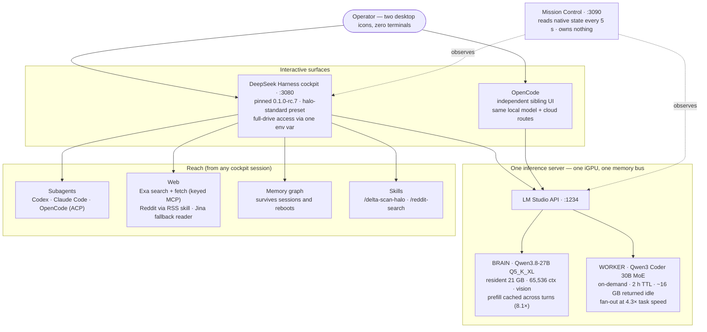
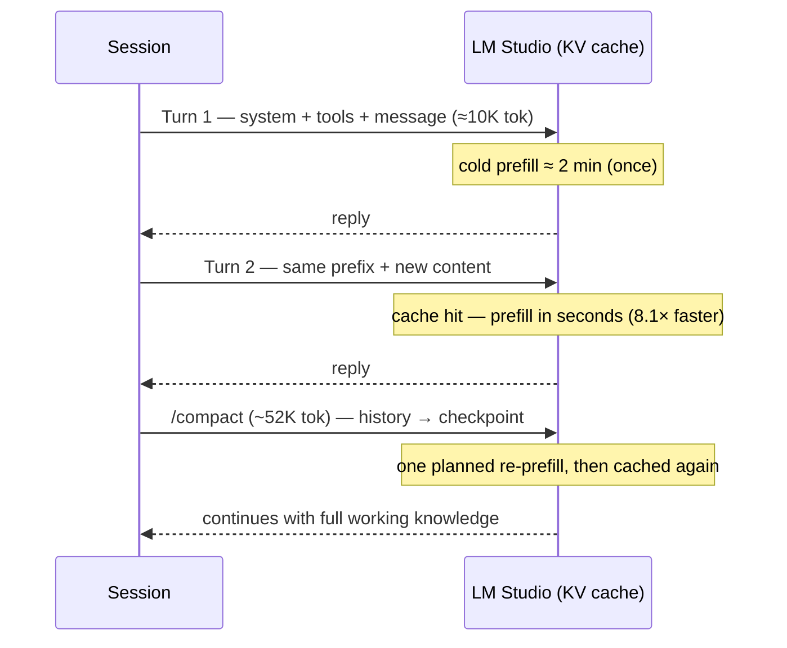
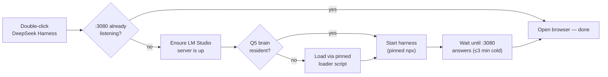

# HALO Stack — User Manual

Daily operation of the local AI stack. For design rationale and bench data, see the
[build log](https://quartz-entry-ptf2.here.now/) (archived in this repo as
`docs/build-log-snapshot-2026-08-17.html`).

## The pieces and their addresses

| Piece | Where | Started by |
|---|---|---|
| Cockpit (DeepSeek Harness) | `http://127.0.0.1:3080` | Desktop icon **DeepSeek Harness** |
| Mission Control dashboard | `http://127.0.0.1:3090` | Desktop icon **Mission Control** |
| LM Studio inference server | `http://127.0.0.1:1234` | Runs as a service at login |
| OpenCode | its own app | On demand (autostart removed on purpose) |

## Architecture

Two interactive surfaces share one inference server; the harness owns
orchestration; a thin dashboard watches everything and owns nothing.

**Why it's fast despite slow silicon** — the request shape is the load-bearing
decision. Every harness request is a byte-exact extension of the previous one,
so the expensive prompt-reading step (prefill) is paid once per session, not
every turn:

**How the launcher boots everything in the right order** (the desktop icon):

Diagrams render on GitHub's repo view. The full architecture rationale —
source-level findings, config composition, permission model, bench data —
lives in the [build log](https://quartz-entry-ptf2.here.now/) (archived here
as `build-log-snapshot-2026-08-17.html`).

## Starting and stopping

**Start:** double-click **DeepSeek Harness**. The launcher checks LM Studio, loads the
Q5 brain if it isn't resident, starts the harness, and opens the browser only when the
page will actually load. Cold boot after a reboot takes 1–3 minutes (npx + 21 GB model);
if it's already running, the icon just opens the page. Nothing to babysit.

**Stop:** close the browser tab (session is safe — it lives on the server), and if you
want the memory back, open Mission Control → **Unload All**. The harness server itself
is a hidden process; it dies with logoff/reboot, or leave it running — it idles free.

## Using the cockpit

- **New session:** pick workspace **Desktop-Code** (not C-Drive — known rc.7 bug: drive
  roots never bind; your sessions have full-drive permission regardless of workspace).
  Preset defaults to **HALO Standard**; model defaults to the local Q5 at **Medium**
  reasoning. Both changeable per-session in the composer.
- **First turn is the slow one.** A fresh session pre-reads ~10K tokens of system prompt
  and tools (up to ~2 min). Every later turn rides the prefix cache — expect seconds of
  wait, not minutes. The one planned slow turn afterward is right after a compaction.
- **Reading the stats bar** (bottom): high TTFT = it was reading (prefill); low TTFT with
  a long run = it was thinking/writing. "Cache hit 0%" is cosmetic — LM Studio doesn't
  report cache fields; trust the TTFT.
- **Slash commands:** `/compact` squeezes history into a checkpoint (continuity is
  proven — it keeps working knowledge). `/permission <mode>` switches access mid-session.
- **Subagents** (HALO Standard preset): the model can call `subagent_codex`,
  `subagent_claude_code`, and `subagent_opencode` — ask it to "get a second opinion from
  Claude" or "hand this to Codex" in plain language. They run on your existing logins.
- **Memory:** say "remember this: …" and it stores a fact in the knowledge graph
  (`~\.dsh\memory\memory.json`) that any future session can recall — survives reboots.
  Ask "what's in your memory about X" to retrieve.
- **Web search & page reading:** every session has `mcp__exa__` tools — live web
  search plus fetch-any-URL-as-markdown — now **keyed** (free Exa account:
  ~1,400 funded searches/month recurring; key in `~\.dsh\.env`, referenced by
  env everywhere, never committed). Ask naturally: "search the web for…".
  Fallback page reader for stubborn non-Reddit pages: `r.jina.ai/<url>` (plain
  HTTP, keyless). The built-in DeepSeek search stays disabled.
- **Reddit research:** type **`/reddit-search`** (shared skill, works in Claude
  Code too). Reddit is unreachable via Exa (licensing hole) and Jina (blocked);
  the skill uses Reddit's own RSS feeds — search, subreddit, and per-thread
  comment feeds (188 comments verified from one megathread) — paced ≥8 s
  between requests to respect anonymous rate limits.
- **Session log:** top-right button downloads the full append-only log of any session.

## Model operations

- **Truth source:** `lms ps --json` (or just look at Mission Control's model card —
  it uses exactly that). Never trust the REST catalog's quantization field.
- **Load/unload:** Mission Control buttons — *Load Brain*, *Load Worker*, *Unload
  Worker*, *Unload All*. The worker auto-unloads after 2 h idle and returns ~16 GB.
- **Sharing:** the cockpit and OpenCode share one brain slot. Simultaneous turns queue —
  nothing breaks, the second one just waits. Watch queue depth in Mission Control.

## When something looks wrong

| Symptom | Cause | Fix |
|---|---|---|
| "Connection refused" at :3080 | Server not started | Desktop icon, or Mission Control → *Start cockpit* |
| Typing doesn't paint / text overwrites itself | Stale pre-restart tab, or Chrome auto-translate | Close tab, open fresh one; keep translate disabled for the site |
| "Deep diving…" for minutes | First-turn prefill, or queued behind another local request | Check Mission Control queue; it finishes — patience, not restart |
| OpenCode on a cloud model unexpectedly | It raced the boot before the model loaded | Click the model name → pick "Local Daily Driver" |
| Workspace won't select in composer | You picked C-Drive | Use Desktop-Code (rc.7 bug; permissions unaffected) |
| Harness won't boot at all | A bad MCP/plugin row (e.g. BrowserMCP) | Check the row `disabled: true` flags in `~\.dsh\cordis.patch.yml` |
| :3080 listening but frozen (0-byte responses, process alive) | Upstream Windows deadlock loading session logs >1 MB ([discussion 2165](https://github.com/deepseek-ai/deepseek-harness/discussions/2165), found by `/delta-scan-halo`) | Kill + relaunch via desktop icon; archive or move old session dirs out of `~\.dsh\sessions\` to keep logs small until fixed upstream |

Full bug list with root causes: README §Known issues and `docs/phases/phase3-reach-results.md`.

## Maintenance

- **Weekly delta scan:** type **`/delta-scan-halo`** in a fresh cockpit session.
  The stack audits its own upstream (harness releases, your five known bugs,
  new quants, llama.cpp changes, community findings via Exa) and tracks scan
  state in its memory graph. Installed as a harness skill at
  `~\.dsh\skills\delta-scan-halo\`; prompt version kept in
  [`HALO-Stack-Monitor-Prompt.md`](HALO-Stack-Monitor-Prompt.md) as the
  reference source. Originally written by the stack's own model.

- **After any live config change** (settings.yaml, patch, preset, launcher, loader):
  run `scripts\Sync-FromLive.ps1`, review `git diff`, commit with the reason. That's the
  whole discipline — it keeps every tuning decision diffable.
- **Backups:** point-in-time snapshots live in
  `Documents\Codex\ConfigBackups\` (pin record, config dumps, phase results, `.dsh` home).
- **Upgrading the harness:** deliberate act, never casual. Change the pin
  (`0.1.0-rc.7`) in both launchers, re-run the Phase 1 smoke tests (repo discovery,
  edit, test, outside-repo write), and re-check the six known bugs — preview releases
  move fast in both directions.
- **Rebuild from nothing:** README §Workflow — install Node 22+, pnpm 11, LM Studio +
  the two GGUFs, run `scripts\Deploy-ToLive.ps1`, recreate the two desktop shortcuts,
  install per-profile subagent plugins (deploy script prints the command).

## Privacy

Nothing in this stack phones home — audited, not assumed. See
[AUDIT-telemetry-2026-08-17.md](AUDIT-telemetry-2026-08-17.md) for the full sweep
(all DeepSeek packages, telemetry source read, live socket proof). Short version:
Qwen models are inert weights; the harness's telemetry exporter ships DISABLED and
builds no sending machinery at all; the only network touches are ones you chose
(Exa search, subagents on your own auth, npm installs). `/delta-scan-halo` guards
the telemetry default on every future release.

## Parked, by choice

- **Hermes operations plane** — cold-session cron + phone messaging; revisit when
  remote workflows outgrow the cloud-agent apps.
- **BrowserMCP** — blocked on an upstream Windows crash; config row ships disabled.
- **Cockpit autostart** — cleared to enable (reboot test passed); currently manual by
  preference.
- **Self-hosted SearXNG** — evaluated 2026-08-17 as the fully sovereign search option
  (uncapped, VPN-covered, runs in the existing WSL2 Ubuntu, no Docker needed). Passed
  over in favor of keyless Exa for zero moving parts. Revisit if the 150/day cap
  pinches or the Exa dependency chafes.
