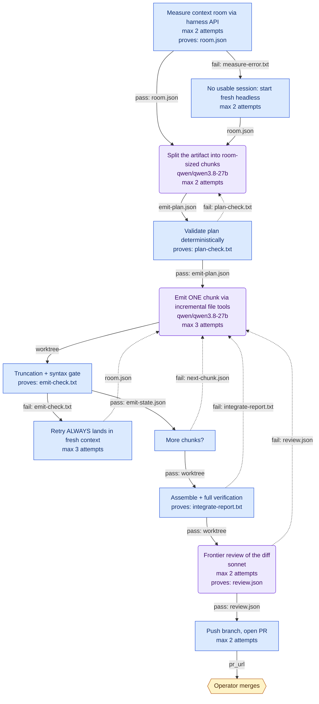

# budgeted-emit-pipeline

**Goal.** Produce arbitrarily large generated artifacts (plugins, modules, documents) on the HALO stack without ever hitting the output-token wall: every emit is sized to measured context room before it is requested, retries always land in fresh context, and the run never stalls waiting for a human 'continue'

**Trigger.** A generative task brief (task-brief.md) lands in the run directory

**Isolation.** `worktree` — declared, and **not created by the generated code**. Set it up in your intake step, or run the workflow somewhere already isolated.

**Shape.** 12 nodes — 8 code, 3 agent, 1 human; 17 edges, 5 of them loops.

## Diagram

## Nodes

| Node | Who | What | Model | Retries | Proves it worked |
|---|---|---|---|---|---|
| `measure_room` | Code | GET the dsh apiproxy sessions tail for the target session; read projections.contextPressure {contextWindow, projectedTokens}; room = contextWindow - projectedTokens; write room.json. This projection exists today (dsh-token-meter -> dsh-host-apiproxy sessions endpoint) - Mission Control already speaks this API. | — | 2, then fail | `room.json` |
| `fresh_session_start` | Code | Start a new dsh --profile headless session (cold context = maximum room: ~55K usable of the 65,536 window after the ~10K boot prefix); write room.json from its measured pressure. | — | 2, then fail | — |
| `plan_chunks` | Agent | Read task-brief.md and room.json. Produce emit-plan.json: an ordered list of chunks, each targeting one file region, with est_tokens <= cap where cap = min(0.5 * room, 12000). The 0.5 factor reserves output budget for thinking tokens, which spend from the same per-reply budget (measured on this stack). Chunks are written with the harness's incremental file tools (create / insert / str_replace), never as one giant tool-call argument. | qwen/qwen3.8-27b | 2, then human | — |
| `plan_check` | Code | Schema-check emit-plan.json; assert every chunk est_tokens <= cap, file regions disjoint, order dependency-safe. Exit non-zero with reasons in plan-check.txt. | — | — | `plan-check.txt` |
| `emit_chunk` | Agent | Generate the current chunk only, writing with create/insert/str_replace so no single tool-call argument exceeds the chunk cap. On rework, the incoming report says exactly what failed - fix that, do not regenerate the artifact. | qwen/qwen3.8-27b | 3, then human | — |
| `emit_check` | Code | Two checks, both deterministic: (1) read the session's last turn/end reason from the apiproxy event tail - reason kind 'max-tokens' is a HARD FAIL even if the file looks plausible, because the harness silently DROPS truncated tool-call blocks (dsh-llm BlockAssembler: max-token truncation discards tool calls); (2) node --check / linter on touched files. Write emit-check.txt. | — | — | `emit-check.txt` |
| `refresh_context` | Code | Park the current session, start a fresh headless session, re-measure room, shrink remaining chunk caps if room changed. Encodes the traced harness behavior: 'continue' after truncation is a brand-new generation against a fuller window, and a truncated tool call is unrecoverable - so never retry a failed emit in the same session. | — | 3, then human | — |
| `route_next` | Code | Router: exit 0 (pass) when emit-state.json shows every chunk emitted and checked; exit 1 (fail) with next-chunk.json otherwise. A code decision - no model call to decide what a file already says. | — | — | — |
| `integrate` | Code | Run the project's full check suite over the assembled artifact (syntax, tests, compose-validation where config is involved); git commit on the run branch. Write integrate-report.txt. | — | — | `integrate-report.txt` |
| `review` | Agent | Adversarial review of the full diff against task-brief.md: correctness, completeness vs the brief, seams between chunks (the failure mode chunked generation adds). Findings to review.json; empty findings = pass. Local models do the bulk; frontier reviews - per the stack's local-first mandate. | sonnet | 2, then human | `review.json` |
| `open_pr` | Code | git push, gh pr create with emit-plan.json + review.json summarized in the body. Repo doctrine: branch + PR into master, never direct. | — | 2, then human | — |
| `accept` | Human | Scott decides whether the artifact is wanted. Merge and any tag are the irreversible, outward-facing steps - the only interior human gate this pipeline has. | — | — | — |

Nodes with an artifact named above cannot pass their claim of success downstream without it: the run treats a missing or empty file as a failure of that node. The bar is that the artifact exists and is not empty, which catches a step that silently did nothing — not a step that writes something worthless.

## Flow

| From | Condition | Carries | To |
|---|---|---|---|
| `measure_room` | pass | `room.json` | `plan_chunks` |
| `measure_room` | fail | `measure-error.txt` | `fresh_session_start` |
| `fresh_session_start` | always | `room.json` | `plan_chunks` |
| `plan_chunks` | always | `emit-plan.json` | `plan_check` |
| `plan_check` | pass | `emit-plan.json` | `emit_chunk` |
| `plan_check` | fail (loop) | `plan-check.txt` | `plan_chunks` |
| `emit_chunk` | always | `worktree` | `emit_check` |
| `emit_check` | pass | `emit-state.json` | `route_next` |
| `emit_check` | fail | `emit-check.txt` | `refresh_context` |
| `refresh_context` | always (loop) | `room.json` | `emit_chunk` |
| `route_next` | pass | `worktree` | `integrate` |
| `route_next` | fail (loop) | `next-chunk.json` | `emit_chunk` |
| `integrate` | pass | `worktree` | `review` |
| `integrate` | fail (loop) | `integrate-report.txt` | `emit_chunk` |
| `review` | pass | `review.json` | `open_pr` |
| `review` | fail (loop) | `review.json` | `emit_chunk` |
| `open_pr` | always | `pr_url` | `accept` |

## Where people are involved

- **`accept` — Operator merges.** Scott decides whether the artifact is wanted. Merge and any tag are the irreversible, outward-facing steps - the only interior human gate this pipeline has.

Human touchpoints belong at intake and acceptance, plus any step whose next action is irreversible. Interior gates cap throughput at one person's attention regardless of available compute — if any of the above sits in the middle, check that the action after it genuinely cannot be undone.

## Model and tool allocation

| Node | Backend | Model | Tools | Payload goes to |
|---|---|---|---|---|
| `plan_chunks` | openai-compat | qwen/qwen3.8-27b | all | this machine (`127.0.0.1`) |
| `emit_chunk` | openai-compat | qwen/qwen3.8-27b | all | this machine (`127.0.0.1`) |
| `review` | claude | sonnet | `Read`, `Grep`, `Glob` | Anthropic |

Scouting and planning decide what everything downstream does, so errors there propagate and get faithfully implemented — those are the nodes worth the strongest model. Mechanical transforms are where a cheaper tier pays off. Narrowing tools on read-only nodes is both a cost control and a safety property.

## Open questions

Unresolved. Each of these is a hole in the design, deliberately left visible:

- Chunk cap constants (0.5 * room, 12K ceiling) are engineering estimates from measured thinking-token overhead - the first two real runs should record actual per-chunk output spend and tune them.
- The truncation detector reads turn/end reasons from the apiproxy sessions event tail; confirmed present in the API surface, but the exact tail-pagination call needs one probe against a live headless session before the check is coded.
- Window expansion (Phase 1 of the fix plan) raises room from ~55K to ~120K usable and roughly doubles the chunk cap; the pipeline needs no structural change when that lands - only room.json values move.
- budget.agent_calls=24 assumes artifacts up to ~15 chunks with modest rework; raise it for book-sized artifacts or the run will hand off mid-work by design.

## Testing a single node

Every edge names its payload, so any node can be run against a fixed input rather than by replaying the whole workflow. The generated scaffold exposes this as `--only <node>`, reading that node's inputs from the run directory. Retry granularity is node granularity: if debugging forces you to rerun everything, the boundaries are in the wrong place.
